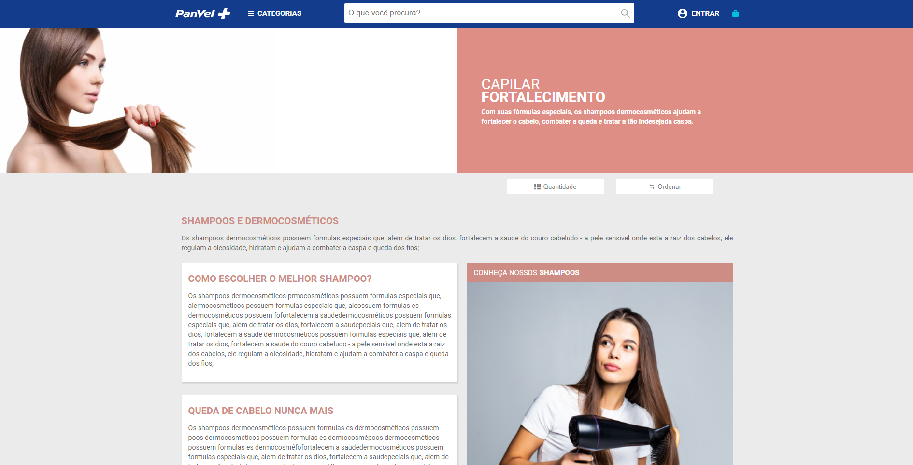

<h1 align="center">
    
    <br>
    Challenge Meza
</h1>


#####This project has been developed by Marcos Costa with the following technologies

  ## 🚀 Technologies
    - [React](https://pt-br.reactjs.org/)

## Instalação

Clone this project with:

```sh
git clone https://github.com/marcoscosta90/mezaChallenge.git
```

Enter the project folder and install the dependencies with:

```sh
npm i
```

After installing the packages, you can start the application with:

```sh
npm start
```

Made by MARCOS COSTA:  [Entre em contato!](https://www.linkedin.com/in/marcoscosta90/)

